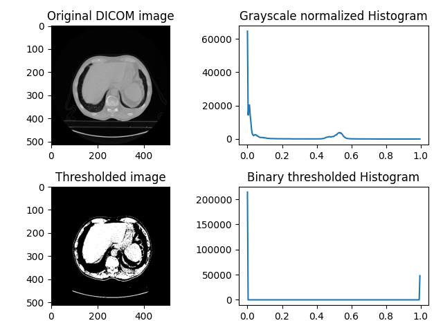

# DICOM Image Upload Application

This application provides a simple web interface to upload DICOM images, calculate thresholded pixel volume, and visualize them. The frontend is built with Vue.js, and the backend API is powered by FastAPI.

## Prerequisites

Before you begin, ensure you have met the following requirements:

- You have installed [Git](https://git-scm.com/book/en/v2/Getting-Started-Installing-Git) on your system.
- You have installed [Docker](https://docs.docker.com/engine/install/) and Docker Compose.

## Project Structure

- `/frontend`: This directory contains the Vue.js application.
- `/backend`: This directory contains the FastAPI application.
- `docker-compose.yml`: This file defines the multi-container Docker application.

## Running the Application

To get the application up and running, follow these steps:

### 1. Clone the repository

```bash
git clone https://github.com/omidvosoughi/dicom-uploader.git
cd dicom-uploader
```

### 2. Build and Run with Docker Compose

Use 'docker-compose' to build and run both the frontend and backend services.

- On Linux:
```bash
sudo docker-compose up --build
```

- On Windows:
```bash
docker-compose up --build
```

This command will build the images if they don't exist and start the containers. The `--build` option ensures that the latest versions of the applications are built and used.

### 3. Accessing the Application

After the containers are up and running, you can access the application in your web browser via following link.

- [http://localhost](http://localhost)

### 4. Upload DICOM Images

Go to the above link and upload DICOM images using the provided dropzone. The uploaded images will be processed by the backend, and the calculated volume. To highlight the distinctions between the original and thresholded images, a function has been implemented. This function plots both images and saves them into [backend/plots/](backend/plots/), alongside their respective histograms, providing a clear visual representation of the differences, as demonstrated in the following images.



### Unit Testing

The application includes unit tests to verify the correct behavior of backend functionalities. One crucial function tested is `pixel_volume`, which calculates the volume of pixels above a certain threshold in a DICOM image.

#### `pixel_volume` Function Test

This test ensures that the `pixel_volume` function correctly computes the volume from a given DICOM file based on the specified threshold. The function reads a DICOM image, normalizes the pixel values, applies a threshold to create a binary mask, and calculates the volume of the selected pixels. The test verifies that the returned volume is within an acceptable margin of error from an expected value, ensuring the function's accuracy and reliability.

The expected outcome of this test is a volume value of approximately 143280.029 $mm^3$ when using a specific test DICOM file and threshold value. This provides confidence that the image processing and volume calculation are performed correctly.

#### Running the Tests

To run the unit tests, first go the backend directory via executing `cd backend`, then execute the unit test command. Replace `<uploaded-dicom-file-name>` with the 
name of uploaded DICOM file and `<your-threshold>` with a float number in range of [0.0 1.0]. 

```bash
cd backend
docker run backend python testPixelVolume.py --dicom <uploaded-dicom-file-name> --threshold <your-threshold>
```

For example:

```bash
cd backend
docker run backend python testPixelVolume.py --dicom 1-101.dcm --threshold 0.5055
```

### Limitation and Future work

The primary objective of this assignment is focused on the application of image thresholding techniques. In the context of medical imaging and DICOM images, thresholding is often used to highlight regions of interest, like tissues, organs, or anomalies, by excluding the pixel values that do not fall within the range of interest, thus simplifying the image for further analysis or visualization.

The central challenge of this task lies in identifying an optimal threshold to achieve the most accurate segmentation of the image. In the current version of the assignment, the threshold was determined manually through testing. However, automating this process constitutes a potential area for future development. The drawback of basic thresholding is the necessity of approximating the threshold value $t$ by examining the image's histogram. There are, nevertheless, automated methods available that can ascertain the threshold on our behalf. Otsu’s method is a notable example of this, particularly effective when the image's grayscale histogram displays distinct peaks representing the background and the foreground subjects.

Image segmentation methods such as image thresholding can be conceptualized as an optimization challenge, where the critical inquiry centers on devising a strategy to predict the most optimal threshold. A further consideration is whether artificial intelligence techniques such as deep learning could be employed to accurately predict this threshold value.


